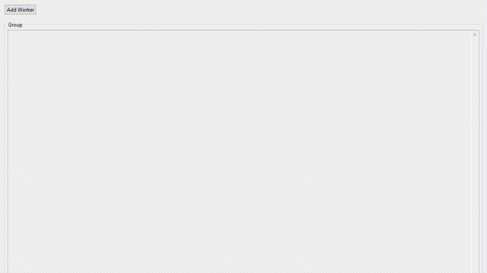
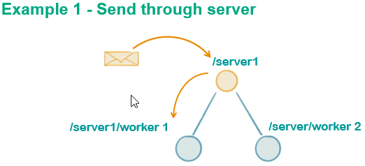
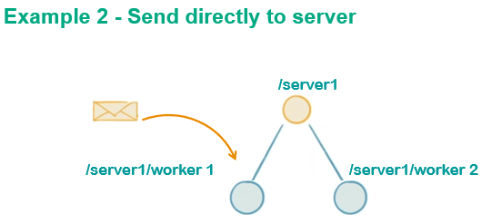

# AKKA Blueprint project

Build powerful concurrent & distributed applications more easily with [AKKA](https://akka.io). This is project to demostrate some richful features provided by AKKA framework when creating application with very lightweight event-driven processes, using some design pattern. Some features used in this project: queue, exchange messages, priority, mailbox. The idea is demonstrate exchange message done as asynchronous, non-blocking and based on highly performant message-driven programming model. Customization on queue mechanism, also allow you to defines fault handling supervisor strategy. 

Besides that, it contains a friendly Java desktop application(SWT) to show the work.

# How run

## Running from desktop application

* Run as java application the file: /akka.gui.examples/src/main/java/org/akka/example/gui/Main.java
* It will raise a Java desktop application made with [SWT](https://www.eclipse.org/swt/) libraries. Which is using "akka.console.example" as dependencies, contains all akka mechanism/process required.
* Click in "Add Worker" to start creating workers, each worker has a set of operation with priorities.
  * You can create infinity workers to see large number of messages exchanged between client and workers.
* When clicking over "Remove/Config/Recovery", you are sending a message to worker to be processed, once is completed, worker replies back to client which will eliminate the job from the app. AKKA framework is supporting this communication.
  * Each operation has priority associated, you can implement own priorization. It means, message with higher priorioty will take over others.
* See app animation below:
	

## Other examples

* Example 1 - /akka.console.example/src/main/java/org/akka/example/demo/MainDemo1.java
  - This is AKKA example to use AbstractActorLogging, Callbacks, sending message to child throught the parent.
	
* Example 2 - /akka.console.example/src/main/java/org/akka/example/demo/MainDemo2.java
  - This is AKKA example to use UntypedActor, sending message to child directly without passing by the parent
  - 
* Example 3 - /akka.console.example/src/main/java/org/akka/example/demo/MainDemoMailBox01
  - This is example how customize mailbox associated to actor.

# How project is composed:

Two maven projects: 

* akka.console.example - It contains AKKA foundation work to see message exchanges.
  - org.akka.example.demo.mailbox - It contains all mailbox type used by this project
  - org.akka.example.demo.message - It contains all message type created
  - org.akka.example.demo.abstractlogging - All actors available
* akka.gui.examples	- It is GUI application

# Development with AKKA

* For more information, see <https://akka.io/>

## Patterns

* Akka patterns
  - <https://www.safaribooksonline.com/library/view/applied-akka-patterns/>
  - <https://www.safaribooksonline.com/library/view/applied-akka-patterns/9781491934876/>

## Tracing/Debuging

* Monitoring AKKA with kamon - http://blog.xebia.com/monitoring-akka-with-kamon/
* Using Zipkin:
	- http://www.lightbend.com/activator/template/activator-akka-tracing
	- https://github.com/levkhomich/akka-tracing/wiki

## References

* https://en.wikipedia.org/wiki/Akka_(toolkit)
* https://en.wikipedia.org/wiki/Play_Framework
* https://dzone.com/articles/webinar-recording-introduction-to-akka-actors-with
* https://www.slideshare.net/johanandren/introduction-to-akka-actors-with-java-8
* https://www.infoq.com/presentations/akka-concurrency-jvm#downloadPdf	- 
* https://pt.slideshare.net/Lightbend/exploring-reactive-integrations-with-akka-streams-alpakka-and-apache-kafka
* https://pt.slideshare.net/Lightbend/lightbend-training-for-scala-akka-play-framework-and-apache-spark
* http://doc.akka.io/docs/akka/current/scala/testing.html
* Supervision - http://doc.akka.io/docs/akka/2.0/general/supervision.html#supervision
* https://blog.codecentric.de/en/2015/08/introduction-to-akka-actors
* http://www.scalaformachinelearning.com/2015/02/akka-mailbox-back-pressure.html
* http://blog.abhinav.ca/blog/2014/01/13/akka-and-backpressure/
* https://blog.knoldus.com/2014/03/13/how-to-create-a-priority-based-mailbox-for-an-actor/ 
* https://blog.codecentric.de/en/2015/08/introduction-to-akka-actors
* https://blog.codecentric.de/en/2016/01/getting-started-akka-cluster/
	
# Videos

* Introduction to Akka Actors with Java 8 - https://www.youtube.com/watch?v=r4dryMdDZz0
* Akka for Concurrency Works - https://www.infoq.com/presentations/akka-concurrency-jvm
* Jonas Bonér on the Actor Model, Akka, Reactive Programming, Microservices and Distributed Systems
 https://www.infoq.com/podcasts/jonas-boner-akka?utm_campaign=infoq_content&utm_source=infoq&utm_medium=feed&utm_term=global
